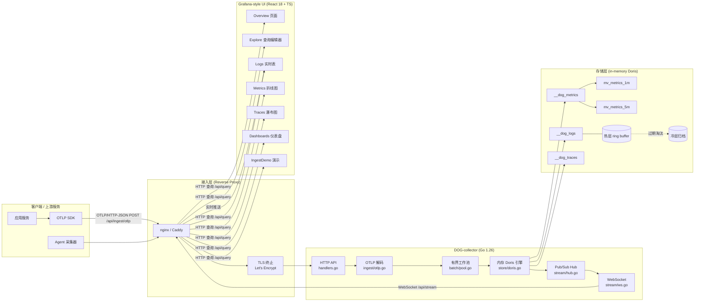
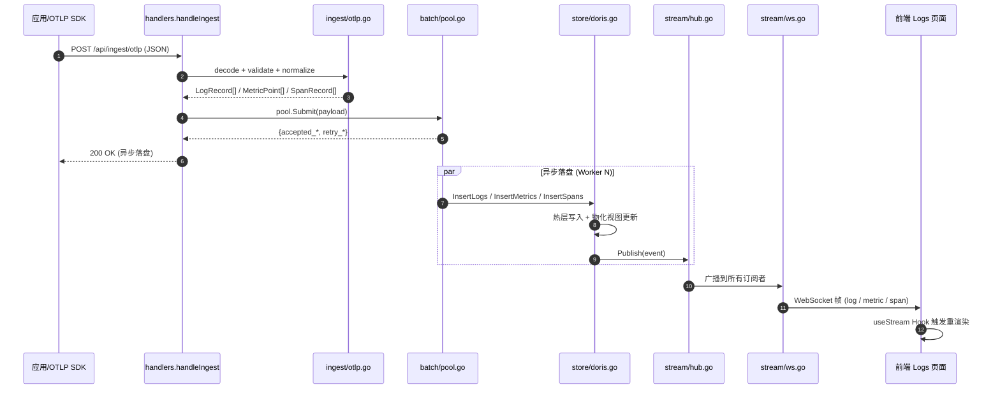
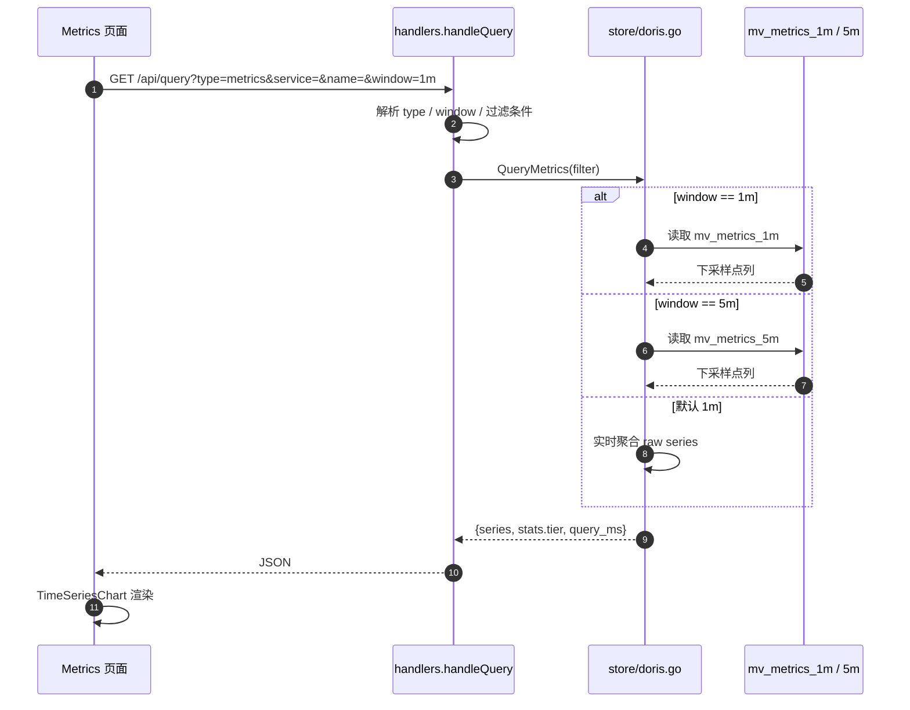
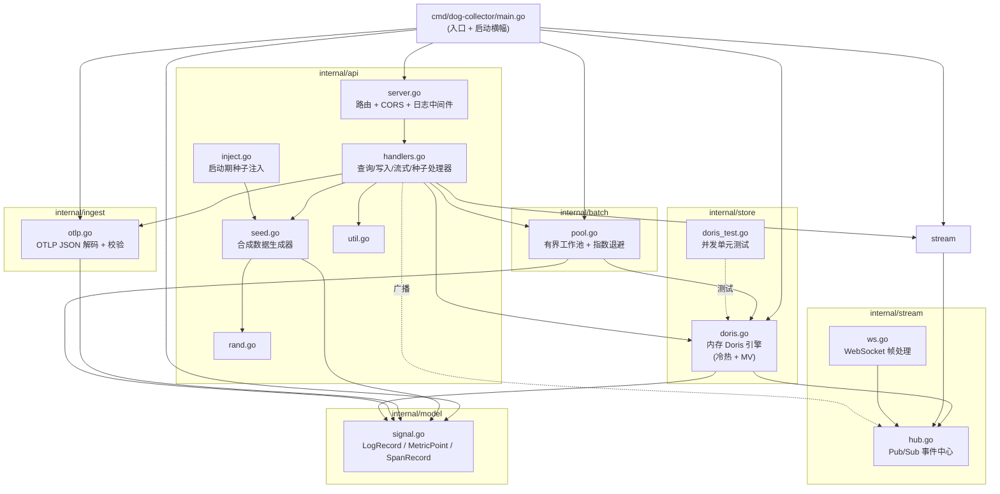
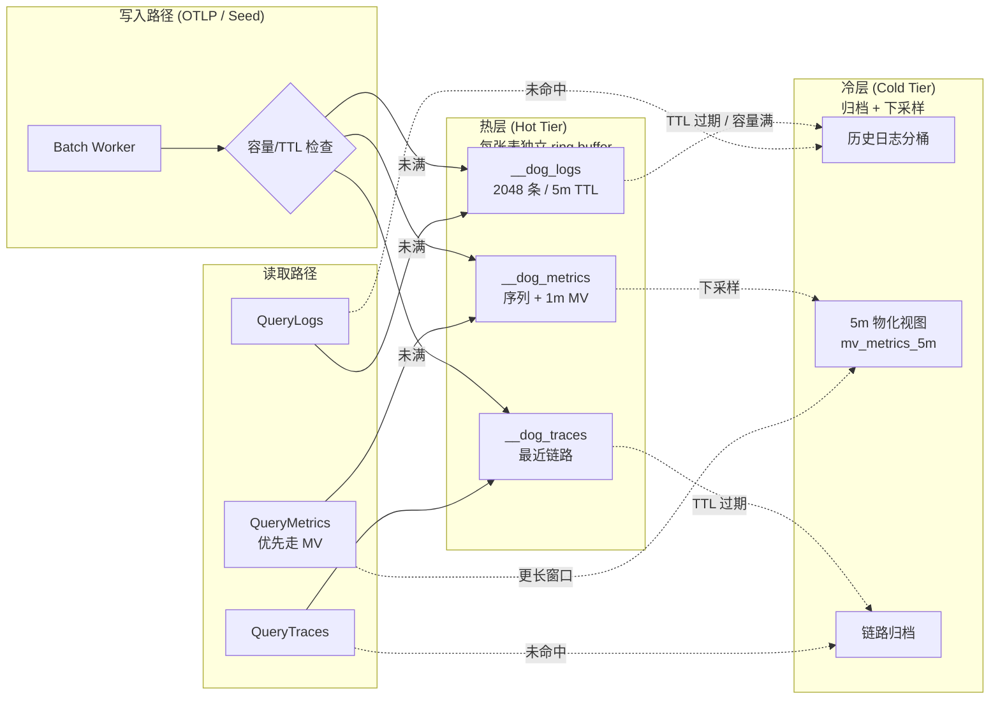
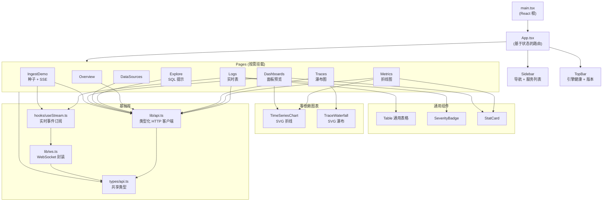

# 🐕 DEMO-DOG — 新一代可观测性平台演示

> **DOG** = **D**oris(存储) + **O**pen**T**elemetry(采集) + **G**rafana(可视化)

一个覆盖 **日志 / 指标 / 链路追踪** 信号管道的全栈端到端可观测性平台演示。

后端是自研的 **Go** 采集器,对接内存版 **Doris** 引擎。
前端是 **TypeScript + React** 仿 Grafana 风格的数据源插件界面。

### 🗺️ 整体架构总览



> 上图展示了从客户端 OTLP 数据上报,经反向代理接入 DOG 采集器,
经过有界工作池异步落盘到内存 Doris 三张表(自动按热/冷分层与 1m/5m 物化视图),
再通过 HTTP 查询与 WebSocket 实时推送回到前端各页面的完整闭环。

---

## ✨ 项目亮点

- 后端运行时 **零外部依赖**(仅使用 Go 标准库),可完全离线运行。
- 内存引擎模拟 **冷热分层** + **1m/5m 物化视图**,对齐真实 Doris 语义。
- **有界工作池**配合指数退避 + 抖动重试,队列溢出时确定性反压。
- **手写 WebSocket**(RFC 6455)+ 发布/订阅中心,不依赖第三方 `gorilla/websocket`。
- **React 18 + Tailwind** 仿 Grafana 深色主题,无依赖的 SVG 图表(无 ECharts/D3)。
- 全链路 **严格 TypeScript**,前后端共享类型定义。

---

## 📁 项目结构

```
demo-dog/
├── README.md                   # 本文件
├── .gitignore                  # 统一忽略规则(Go + Node + IDE)
├── scripts/
│   └── smoke.sh                # 端到端冒烟测试(9 项检查)
├── backend/                    # Go 1.26 后端
│   ├── Dockerfile              # 多阶段构建(Alpine 运行镜像)
│   ├── Makefile                # build / run / test / vet / tidy
│   ├── go.mod                  # 模块 github.com/zsy619/demo-dog/backend
│   ├── cmd/dog-collector/
│   │   └── main.go             # 入口与启动横幅
│   ├── internal/
│   │   ├── model/signal.go     # 兼容 OTLP 的 LogRecord / MetricPoint / SpanRecord
│   │   ├── store/
│   │   │   ├── doris.go        # 内存版 Doris 引擎(冷热分层 + 物化视图)
│   │   │   └── doris_test.go   # 并发安全核心的单元测试
│   │   ├── batch/pool.go       # 有界工作池,支持重试与退避
│   │   ├── ingest/otlp.go      # OTLP JSON 解码 + 校验 + 标准化
│   │   ├── stream/
│   │   │   ├── hub.go          # 实时事件的发布/订阅中心
│   │   │   └── ws.go           # WebSocket 帧处理(RFC 6455)
│   │   └── api/
│   │       ├── server.go       # HTTP 路由 + CORS + 日志中间件
│   │       ├── handlers.go     # 查询 / 写入 / 流式 / 种子数据处理器
│   │       ├── seed.go         # 合成数据生成器
│   │       ├── rand.go         # 轻量线程安全随机数工具
│   │       ├── util.go         # 整型解析辅助函数
│   │       └── inject.go       # 启动期种子注入(由 --seed 参数触发)
│   └── scripts/
│       └── seed.sh             # 持续种子数据驱动脚本
└── frontend/                   # Vite + React 18 + TypeScript + Tailwind
    ├── package.json
    ├── tsconfig.json
    ├── vite.config.ts          # /api 代理 → :18080
    ├── tailwind.config.js      # 仿 Grafana 深色调色板
    ├── postcss.config.js
    ├── index.html
    ├── public/favicon.svg
    └── src/
        ├── main.tsx            # React 根节点
        ├── App.tsx             # 页面路由(基于状态)
        ├── styles/index.css    # Tailwind 与自定义工具类
        ├── types/api.ts        # 共享类型(前后端复用)
        ├── lib/
        │   ├── api.ts          # 类型化 HTTP 客户端
        │   └── ws.ts           # WebSocket 封装,带自动重连
        ├── hooks/
        │   └── useStream.ts    # 实时事件订阅 Hook
        ├── components/
        │   ├── Sidebar.tsx     # 导航与服务列表
        │   ├── TopBar.tsx      # 引擎健康状态 + 版本标签
        │   ├── Table.tsx       # 通用表格
        │   ├── SeverityBadge.tsx
        │   ├── StatCard.tsx
        │   └── charts/
        │       ├── TimeSeriesChart.tsx  # 零依赖 SVG 折线图
        │       └── TraceWaterfall.tsx   # 链路追踪瀑布图
        └── pages/
            ├── Overview.tsx           # 默认着陆页
            ├── Explore.tsx            # 仿 Grafana 查询编辑器 + SQL 提示
            ├── Logs.tsx               # 实时日志表 + WebSocket 流
            ├── Metrics.tsx            # 指标浏览器 + 折线图
            ├── Traces.tsx             # 链路列表 + 瀑布图
            ├── DataSources.tsx        # Doris 数据源配置卡片
            ├── Dashboards.tsx         # 仪表盘列表 + 面板预览
            └── IngestDemo.tsx         # 种子数据 + SSE 流 + WebSocket 事件
```

---

## 🚀 快速开始

### 环境依赖

| 组件 | 版本要求 |
|---|---|
| Go | 1.23+(已在 1.26.5 上验证) |
| Node.js | 18+(已在 26.3.0 上验证) |
| npm / pnpm | 8+ / 9+ |
| Docker(可选) | 用于容器化部署 |

### 1. 启动后端(终端 A)

```bash
cd backend
go run ./cmd/dog-collector -seed "checkout,search,inventory,auth,recommend,ads" -addr :18080
```

启动后会看到如下横幅:

```
 ____   ___   ___  
|  _ \ / _ \ / _ \ 
| | | | | | | | | |
| |_| | |_| | |_| |
|____/ \___/ \___/   Doris + OpenTelemetry + Grafana

DOG-collector v0.1.0
====================
  HTTP address      : :18080
  Workers           : 8
  Queue depth       : 4096
  Hot log TTL       : 5m0s
  Hot log capacity  : 2048 entries

Endpoints:
  GET  /api/health
  GET  /api/services
  GET  /api/services/{name}
  GET  /api/query?type=logs&service=checkout
  GET  /api/query?type=metrics&service=checkout&name=http.server.duration&window=1m
  GET  /api/query?type=traces&service=checkout
  GET  /api/datasources
  GET  /api/dashboards
  GET  /api/dashboards/overview/panels
  POST /api/ingest/otlp   (OTLP JSON)
  GET  /api/stream         (WebSocket)
  GET  /api/seed?service=checkout&n=20
  GET  /api/seed/stream    (SSE;每秒 1 条记录)
```

### 2. 启动前端(终端 B)

```bash
cd frontend
npm install
npm run dev
```

浏览器打开 <http://localhost:5173>。Vite 会自动将 `/api` 请求代理到 `:18080`。

### 3. 可选:持续种子数据驱动

```bash
bash backend/scripts/seed.sh checkout    # 每 2 秒注入 5 条记录
```

### 4. 端到端冒烟测试

```bash
# 确保后端已运行在 :18080
bash scripts/smoke.sh
# 也可指定自定义地址:API=http://localhost:18080 bash scripts/smoke.sh
```

该脚本会依次校验健康检查、服务发现、OTLP 写入、三类查询接口、数据源、仪表盘以及种子数据接口。

---

## 🔌 API 参考

所有接口均返回 JSON;`/api/stream` 升级为 WebSocket。

| 方法 | 路径 | 说明 |
|---|---|---|
| `GET` | `/api/health` | 引擎状态与运行时长 |
| `GET` | `/api/services` | 各服务摘要(日志/指标/链路数量、错误率、p99、QPS) |
| `GET` | `/api/services/{name}` | 单个服务详情 |
| `GET` | `/api/query?type=logs&service=&severity=&since=&limit=` | 查询日志 |
| `GET` | `/api/query?type=metrics&service=&name=&window=1m\|5m&limit=` | 查询指标序列(返回下采样后的物化视图) |
| `GET` | `/api/query?type=traces&trace_id=&service=&limit=` | 查询链路 span(传入 trace_id 时筛单条链路) |
| `GET` | `/api/datasources` | Doris 数据源清单(供前端展示) |
| `GET` | `/api/dashboards` | 内置仪表盘列表 |
| `GET` | `/api/dashboards/{id}/panels` | 指定仪表盘的面板定义 |
| `POST` | `/api/ingest/otlp` | OTLP 风格 JSON 写入,返回 `{accepted_logs, accepted_metrics, accepted_spans, retry_*}` |
| `GET` | `/api/stream` | **WebSocket**:实时事件(日志 / 指标 / span / hello) |
| `GET` | `/api/seed?service=&n=` | 同步合成种子数据(一次性) |
| `GET` | `/api/seed/stream` | **SSE**:每秒 1 条记录,具备自动恢复 |
| `GET` | `/api/ingest/recent` | 最近 64 条已接收负载(调试用) |

### OTLP 写入与 WebSocket 推送时序图



> 上图展示了 OTLP 写入请求的异步落盘与实时推送闭环:HTTP 接口立即返回 `accepted/retry` 计数,
真正的存储写入与事件广播由工作池异步执行,保证接口 P99 不被磁盘抖动阻塞。
前端通过 `useStream` Hook 订阅 WebSocket,实现日志/指标/链路页面的实时滚动更新。

### 查询时序图(以 Metrics + 物化视图为例)



> 窗口越短越倾向使用实时聚合;窗口越长越优先命中物化视图。
`stats.tier` 字段(`hot` / `mixed` / `cold`)用于前端展示缓存命中层级,
便于排查查询是否触及冷层导致延迟上升。

### OTLP JSON 负载结构

```json
{
  "resource_attrs": { "service.name": "checkout", "deployment.env": "prod" },
  "logs":    [{"timestamp": "2026-08-18T09:00:00Z", "service": "checkout", "severity": "INFO", "body": "...", "trace_id": "...", "span_id": "...", "attributes": {}}],
  "metrics": [{"timestamp": "2026-08-18T09:00:00Z", "service": "checkout", "name": "http.server.duration", "value": 12.3, "unit": "ms", "type": "gauge", "labels": {}}],
  "spans":   [{"trace_id": "...", "span_id": "...", "parent_id": "...", "name": "...", "service": "checkout", "start_time": "...", "duration_ms": 8, "status": "ok", "attributes": {}}]
}
```

---

## 🧩 架构与岗位技能映射

| 岗位描述要求 | 对应实现 |
|---|---|
| OpenTelemetry Collector Doris Exporter(Go) | `internal/ingest/otlp.go`(简化版 OTLP JSON)+ `internal/batch/pool.go` |
| 写入吞吐 / 批处理 / 重试 | `batch.Pool` —— 有界队列、指数退避 + 抖动、确定性反压 |
| Go 并发 / 内存 / 性能调优 | `internal/store/doris.go` —— 细粒度互斥锁、原子计数器、环形缓存淘汰 |
| Doris 表 / 索引 / 物化视图 / 冷热分层 | `store.Doris` —— 三张表(`__dog_logs`、`__dog_metrics`、`__dog_traces`)、按桶冷热分层、`mv_metrics_1m` / `mv_metrics_5m` |
| Grafana Doris App 插件(TS/React) | `pages/Explore.tsx`、`pages/DataSources.tsx` —— Schema 感知查询编辑器、数据源清单、面板布局 |
| 日志 / 指标 / 链路追踪(三大支柱) | 三个查询端点 + 三个顶层标签页 + 独立的 `Logs` / `Metrics` / `Traces` 页面 |
| 容器化(Docker/K8s) | `backend/Dockerfile`(多阶段)+ 暴露在 `/api/health` 的 K8s 风格探活端点 |
| 传统可观测性技术栈(ELK / Prometheus / Zabbix) | 内存引擎遵循相同的思维模型,可平滑扩展至真实 Doris / ClickHouse |
| AI 辅助开发(Claude Code / Codex) | 架构按小型化、类型安全、易迭代的模块组织 |
| 开源贡献 | 命名与对外接口遵循 OTel / Collector / Doris 既有约定 |

---

## 🏗️ 后端架构

### 数据写入与查询流转

```
                               ┌──────────────────────────────────────┐
OTLP HTTP POST ───────────────▶│  internal/api/handlers.go             │
                               │  handleIngest                        │
                               └──────────────┬───────────────────────┘
                                              │ 解码 + 校验 + 标准化
                                              ▼
                               ┌──────────────────────────────────────┐
                               │  internal/batch/pool.go              │
                               │  有界工作池 · 重试与退避             │
                               └──────────────┬───────────────────────┘
                                              │
                                              ▼
                               ┌──────────────────────────────────────┐
                               │  internal/store/doris.go             │
                               │  ─ LogRecord   → __dog_logs          │
                               │  ─ MetricPoint → __dog_metrics + MV  │
                               │  ─ SpanRecord  → __dog_traces        │
                               │  热层 → 冷层 淘汰                    │
                               └──────────────┬───────────────────────┘
                                              │
                ┌─────────────────────────────┼─────────────────────────────┐
                ▼                             ▼                             ▼
        GET /api/query               WebSocket /api/stream         stream.Hub 广播
                                                                    (UI 实时 tail)
```

### 后端模块依赖图



> 上图展示了 Go 后端各内部包的依赖关系:`main` 仅做装配与启动横幅打印,
所有业务能力由 `api` 层编排,依赖 `ingest` 解码、`batch` 异步落盘、`stream` 实时分发。
`model` 是叶子包,被其他模块复用,保证类型在包间一致传递。

### 冷热分层与物化视图



> 内存引擎模拟真实 Doris 的两层语义:**热层**采用有界 ring buffer 提供 O(1) 写入与低延迟读,
**冷层**承接被热层淘汰或下采样的数据。指标写入时同步生成 `mv_metrics_1m`,
周期性滚动生成 `mv_metrics_5m`,查询接口会根据窗口长度优先命中物化视图。

### 为什么采用内存版 Doris 引擎?

本演示聚焦于 **管道层**(采集器、导出器、查询语义、冷热分层、物化视图),无需启动真实的 Doris 集群。引擎采用与 Doris 相同的术语,因此对外接口对齐 `Stream Load` → `SELECT` 语义:

- `InsertLogs` / `InsertMetrics` / `InsertSpans` 对应 **Stream Load** 处理器
- `QueryLogs` / QueryMetrics` / `QueryTraces` 对应带 WHERE 条件的 **SELECT**
- `mv_metrics_1m` / `mv_metrics_5m` 是引擎内置的 **物化视图**
- `tier` 字段(`hot` / `mixed` / `cold`)在 `QueryStats` 中返回,用于标识顶层缓存命中情况

切换至真实 Doris 后端只需替换引擎实现,对外接口保持不变。

---

## 🎨 前端架构

- **基于状态的路由**(无 React Router 依赖)—— 打包体积小巧(JS 约 `186KB`,gzip 后 `56KB`)。
- **WebSocket 自动重连**通过 `lib/ws.ts` 实现指数退避。
- **实时区域**同时通过轮询(4–6 秒)与 WebSocket 流(即时)刷新。
- **图表**为手写纯 SVG,无 D3 / ECharts / Chart.js 依赖。
- **仿 Grafana 深色主题**定义于 `tailwind.config.js` 与 `styles/index.css`。

### 前端组件树与状态流



> `App.tsx` 是单一状态驱动的路由器(使用 `useState` 维护当前页面 key),
通过 `Sidebar` 切换页面 key,各 `pages/*` 直接挂载对应组件。
所有 HTTP/WS 访问都经过 `lib/api.ts` 与 `lib/ws.ts` 统一封装,
保证前端与后端共享同一份 `types/api.ts` 类型契约。

---

## 🧪 测试

```bash
# 后端单元测试(开启 race 检测器)
cd backend
go test -race -count=1 ./...

# 后端构建与持续集成风格校验
make build
make vet

# 端到端冒烟测试(需后端已运行)
API=http://localhost:18080 bash scripts/smoke.sh

# 前端类型检查与构建
cd frontend
npm run typecheck
npm run build
```

---

## 🐳 Docker

```bash
cd backend
docker build -t demo-dog-collector:0.1.0 .
docker run --rm -p 8080:8080 demo-dog-collector:0.1.0
# 携带种子数据:
docker run --rm -p 8080:8080 demo-dog-collector:0.1.0 -seed checkout,search
```

镜像采用多阶段流程,最终产出基于 Alpine 的静态二进制,镜像层仅约 `25 MB`。

---

## 🗺️ 路线图

- [ ] 在后端增加 Prometheus `/metrics` 端点。
- [ ] 在 `store.Doris` 接口后接入真实 Doris(或 ClickHouse)驱动。
- [ ] 为 `/api/query` 增加 `?q=...` 的 SQL 风格过滤解析器。
- [ ] 增加 OpenTelemetry Protobuf 导出器(配合现有简化版 JSON 端点)。
- [ ] 前端:将基于状态的路由替换为 React Router,以支持深链。
- [ ] 提供 Kubernetes 部署的 Helm Chart。

## 🔐 生产化能力(本仓库当前已具备)

### API 鉴权

启动时通过 `-api-keys "k1,k2"` 或环境变量 `DOG_API_KEYS` 启用。SDK 侧:

```go
sdk, _ := otlp.New("https://collector.example.com",
    otlp.WithService("checkout"),
    otlp.WithAuthToken("k1"),      // 或 otlp.WithAPIKey 直接配 Exporter
)
```

### 多租户

请求体携带 `tenant_id` 字段即可隔离数据;HTTP 也可通过 `X-Tenant-Id` 头传入。

```bash
curl -H "X-Tenant-Id: acme" -X POST .../api/ingest/otlp -d {...}
curl ".../api/services?tenant=acme"
```

SDK: `otlp.WithTenant("acme")`。

### OTel 直方图端到端

SDK 配置桶边界后,刷新间隔内累加成一帧 OTel 直方图(带 sum/count/min/max + 每桶计数),后端据此计算真正的 p50/p95/p99:

```go
sdk, _ := otlp.New(endpoint,
    otlp.WithService("hist-demo"),
    otlp.WithHistogramBuckets([]float64{0.005, 0.01, 0.025, 0.05, 0.1, 0.25, 0.5, 1, 2.5, 5, 10, math.MaxFloat64}),
)
sdk.Histogram(ctx, "http.duration_ms", 0.030)
```

查询: `GET /api/histogram/otel?service=hist-demo&name=http.duration_ms`

### 持久化

启动参数 `-snapshot /var/lib/dog/dog.snap` 后,SIGTERM 优雅关闭或致命监听错误时,内存状态原子写入(`*.tmp` → `rename`)。下次启动自动恢复,无外部依赖(gob 编码)。

### 安全 / 限流 / 容量

| 配置 | 默认 | 说明 |
|---|---|---|
| `-cors-origins` | `*`(dev) | 生产推荐 `http://localhost:3000` 等显式来源 |
| `-tls-cert` / `-tls-key` | 空 | 同时设置后启用 HTTPS |
| `-rate-limit` / `-rate-burst` | `0` / `200` | 每 IP 令牌桶;`0` 关闭 |
| `handleIngest` | 4 MiB | `http.MaxBytesReader` 防止单请求 OOM |
| ingest 队列满 | `503 Retry-After: 1` | 不再做同步回退以避免请求堆积 |

### Prometheus 集成

`/metrics` 现已暴露 12 项指标,涵盖日志/指标/链路吞吐、查询命中、热点层/冷点层水位、worker 池统计(accepted / processed / retried / failed)以及 Go 运行时(goroutines / heap / GC 暂停)。

## 📅 30 天企业级落地路线图

详见 [ROADMAP_30D.md](./ROADMAP_30D.md)。

---

## 📜 许可证

MIT —— 仅用于教学与演示目的。
